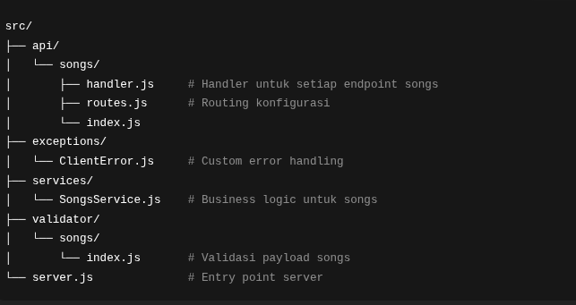

# OpenMusic API

OpenMusic API adalah layanan backend untuk manajemen data musik (lagu dan album), dibangun dengan Node.js dan framework Hapi.js.
API ini dirancang modular, mudah di-maintain, serta mengikuti prinsip clean code dan error handling yang terstruktur.


## Fitur Utama

1. CRUD Songs → Tambah, baca, ubah, dan hapus data lagu
2. CRUD Albums → Tambah, baca, ubah, dan hapus data album
3. Validasi Payload menggunakan custom validator
4. Error Handling dengan custom exception (ClientError)
5. Response API Konsisten (status, message, data)
6. Arsitektur modular (service, handler, validator, routes terpisah)

## 🛠️ Teknologi yang Digunakan

1. Node.js (Runtime Environment)
2. Hapi.js(Framework server)
3. ES Modules (ESM) → import/export modern
4. Nodemon → untuk development environment

## Struktur Direktory



## 🚀 Instalasi & Menjalankan

1. Clone repository

```bash
git https://github.com/saul-paulus/api-openmusic-v2_dicoding.git
cd openmusic-api
```

2. Install dependencies

```bash
npm install
```

3. jalankan server

```bash
npm run start
```

### 📌 Catatan

Proyek ini dibuat sebagai bagian dari submission Dicoding - Belajar Fundamental Aplikasi Back-End (Tugas Akhir Projek 2).
Namun, arsitektur dan penulisan kode dioptimalkan agar sesuai dengan standar industri untuk backend API development.
